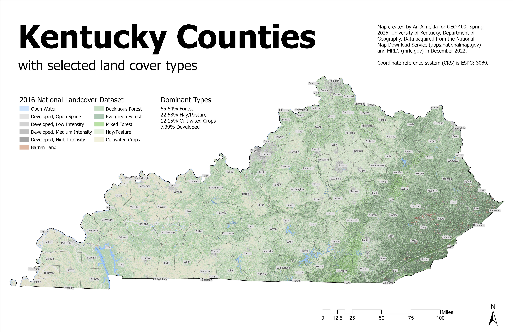
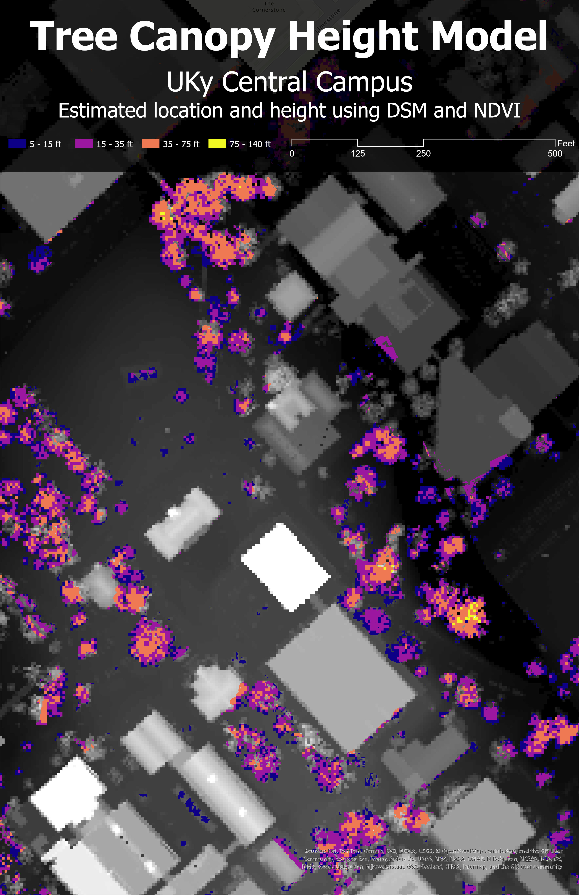

# GEO 409 Field Trip Maps

### Maps for field trip to measure tree canopy

Kentucky map with selected land cover types - [Download geospatial PDF](LayoutKYLandCover.pdf)

UKy central campus canopy model - [Download geospatial PDF](trees.pdf)

Maps created by Ari Almeida for GEO409, Spring 2025, University of Kentucky Department of Geography.